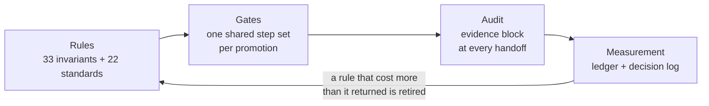
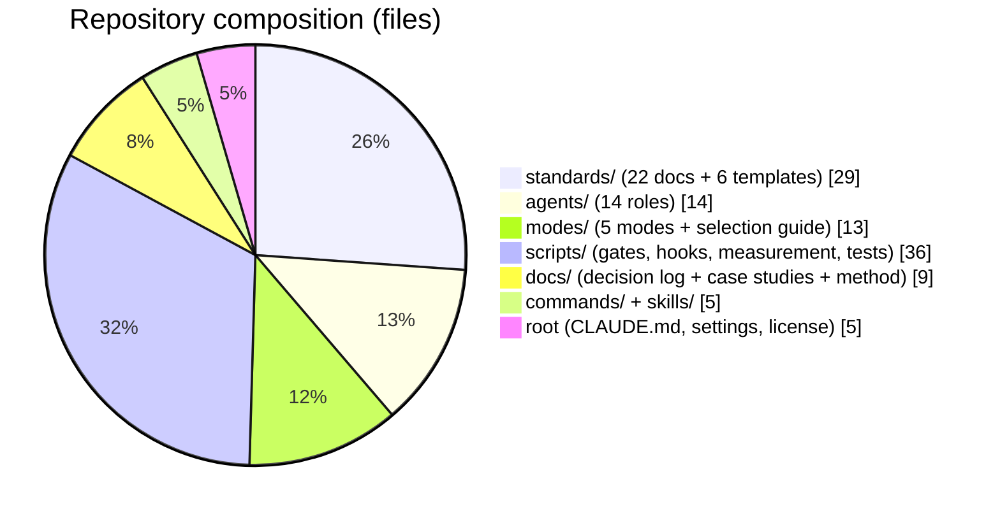
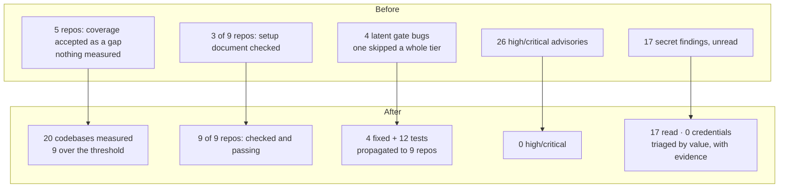
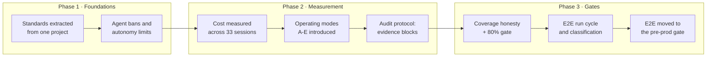

# claude-code-standards

**An SDLC discipline that an AI coding agent cannot skip, argue with, or quietly
forget — and that does not cost a fortune to run.**

AI changed how we write software. It did not change what makes software safe to
ship. The practices we always knew we *should* follow — a real coverage
threshold, a secret scan on every push, backward-compatible schema changes, a
setup document someone else can follow, an e2e suite before production — were
mostly aspirations, because doing them by hand on every change was too
expensive in attention.

An agent will happily do all of it. An agent will just as happily tell you it
did.

That difference is what this repository is about. Everything here exists to make
the discipline **mechanical**: rules an agent reads before it starts, gates that
fail loudly when a step did not run, and audits that assume the agent — and the
person supervising it — will make mistakes.

## Who this is for

- You build production software with an AI coding agent, and "it looks fine"
  is not a standard you can ship on.
- You want SDLC / SSDLC practice applied per change, not per quarter.
- You have felt the agent-team bill and want the discipline without it.
- You want the flows shaped by **SDLC roles** — analyst, architect, developer,
  qa, devops, security, data, e2e — rather than one agent doing everything.

Not for you if you want a prompt pack. There are no clever prompts here. There
are rules, gates, measurements, and the record of what each one cost.

## What it actually does

**1. Makes best practice mechanical.** 33 invariant rules load into every
session; 22 standards documents carry the detail. The agent does not decide
whether backward compatibility matters this time.

**2. Enforces it when the rule is not enough.** A shared gate
(`scripts/gate-core.sh`) runs the same step set in every repository: formatter,
typecheck, build, unit tests, **coverage per codebase**, secret scan,
dependency CVE, SAST, backward-compatibility scan, guidance-file budget, and a
missing-e2e-spec check. One step cannot be waived at all — coverage — because a
threshold with an exception is a suggestion.

**3. Keeps the cost down, on measurement rather than feel.** Agent teams can be
very expensive: a subagent's tokens cost roughly **4x** an orchestrator turn,
and the fixed prompt prefix is re-read on every request — across the records in
this repository that is **~11.1 billion tokens**. So the default mode uses
almost no agents, the expensive modes are opt-in, and the audit protocol buys
its rigour through the *shape of the output* instead of another agent:
a role returns the **command that produced its finding**, and re-running that
command costs about nothing.

**4. Scales up to agent teams when you want them.** Five operating modes, A to
E: no agents, three agents, nine roles, fourteen roles, fan-out. The mode is one
file in the project; choosing it *is* the approval, so there is no per-call
friction. Nothing else in the rule set changes with the mode.

**5. Runs fast, with as little repetition as possible.** Merging to `dev` is
deliberately fast — build and unit tests only. The heavy gates run where code
leaves for the outside world. The formatter runs once at the end of a task list,
not per commit. E2E belongs to the pre-production gate alone, not to every
branch.

**6. Does not trust the role agents.** Every role whose output someone relies on
closes its report with an evidence block: the command it ran, each requested
item mapped to `file:line`, and what it could not verify. A report with no
evidence is not accepted. **What cannot be verified does not count as fine.** If
something is missing, the work goes *back* to the producer — it is not escalated
to the human as a question.



---

## What is in here

The live configuration, not a showcase written for display — most rules exist
because something broke first.

| What | Where | Count |
|---|---|---|
| Working rules (index loaded every session) | `CLAUDE.md` | 33 rules |
| Engineering standards | `standards/` | 22 documents + 6 templates |
| Agent roles (each with explicit scope and prohibitions) | `agents/` | 14 roles |
| Operating modes (agent use + review + approval policy) | `modes/` | 5 modes |
| Gate and measurement scripts | `scripts/` | 19 scripts + 160 tests |
| Slash commands and skills | `commands/`, `skills/` | 5 |
| Decision log (rationale and measurement per rule) | `docs/` | — |



## Why it is measurement-driven

There are numbers behind these rules, not opinions. The decision log records how
each rule was discovered, which measurement produced it, and the text of rules
that have since been retired.

**Test coverage: what was reported vs. what was true**

| | | |
|---|---|---|
| Reported (raw) | `████████████████████` | **95.0%** |
| Honest (generated code excluded) | `█████████████████░░░` | **83.0%** |
| Same project, web codebase | `███░░░░░░░░░░░░░░░░░` | **~14%** |

EF Core migrations made up **85% of the denominator**. A single averaged number
hid the fact that 107 of 136 web files had no test touching them at all.

**Where the cost actually was**

| | | |
|---|---|---|
| Orchestrator cache reads | `███████████████░░░░░` | **73%** of total |
| Agent turns | `██░░░░░░░░░░░░░░░░░░` | **7.7%** of total |

Every agent call required approval, and the stated reason was cost. The
measurement showed the approval friction was guarding 7.7% of the bill while
slowing down every turn.

**Estimate vs. measurement for one agent role (`qa`, opus)**

| | | |
|---|---|---|
| Estimated (before) | `████████████████████` | $8 – $20 / turn |
| Measured (3 records, script) | `████░░░░░░░░░░░░░░░░` | **$4.10** / turn |

The estimate was 2–5x too high. The table was corrected; the estimate was not
defended.

## What it changed: before and after

One working day, nine repositories, one shared gate. Every number below was read
from the run that produced it — each codebase measured separately, never
averaged (#29).

**Coverage: from "accepted as a gap" to a number**

Five repositories listed `coverage` in their gate's accepted-gaps line. Their
gates printed GREEN while **nothing measured coverage at all**.

| | | |
|---|---|---|
| Codebases with a measured number, before | `░░░░░░░░░░░░░░░░░░░░` | **4** |
| After | `████████████████████` | **20** |
| Of those, at or above the 80% threshold | `█████████░░░░░░░░░░░` | **9** |

**The rule-#16 setup document (fail-closed)**

The gate's document step only fired when a stack sat at the repository root, so
it looked at three repositories and failed all three. Fixing the detection made
it look at nine.

| | | |
|---|---|---|
| Repositories the step examined, before | `██████░░░░░░░░░░░░░░` | **3 of 9** |
| Passing, before | `░░░░░░░░░░░░░░░░░░░░` | **0 of 3** |
| Examined, after | `████████████████████` | **9 of 9** |
| Passing, after | `████████████████████` | **9 of 9** |

**One web codebase, taken over the line**

| | | |
|---|---|---|
| Before — 141 tests | `██████████████░░░░░░` | **57.2%** |
| After — 221 tests | `████████████████████` | **81.4%** |

Eighty tests, and not one of them written for the percentage: a cancelled prompt
must not be read as a quota of zero, a failed delete must not navigate away as
if it had succeeded, a missing invitation token must render no form at all. The
repository's other codebase was already at 87.7%, so **both** are now above the
threshold and coverage stopped being its promotion blocker.

**Security findings, cleared**

| | | |
|---|---|---|
| High/critical dependency advisories | `████████████████████` **26** &rarr; `░░░░░░░░░░░░░░░░░░░░` **0** | four repositories |
| Secret-scan findings, read | `████████████████████` **17** | across two repositories |
| Of those, actual credentials | `░░░░░░░░░░░░░░░░░░░░` **0** | expired tokens, a model id, an interface name, a placeholder that says "enter a secret here" |

The scans had been failing for a while and nobody had read them. Reading them
mattered more than fixing them: a wrong escalation ("rotate the payment key")
was corrected by looking at the value the rule actually matched.

**Four bugs in the gate itself**

The gate is the thing that is supposed to catch everything else, so its own
defects are the most expensive kind. All four were found by reading failures
instead of trusting them, all four are covered by a test that fails without its
fix, and all four were propagated to nine repositories.

| Bug | What it did |
|---|---|
| `.slnx` and nested `.csproj` invisible | **Skipped an entire .NET backend** — 673 tests, a red build, two high-severity advisories — and printed GATE GREEN |
| `coverage` waivable via accepted gaps | Turned rule #29's "no exceptions" into a suggestion in five repositories |
| jest handed vitest's `--run` | Reported a passing suite of 10 tests as failing |
| Node detected only at the root | Skipped the setup-document check in any repository whose JS lives one level down |

⚠️ The first one is the one to remember. A gate that fails is annoying; a gate
that reports success for work it never looked at is worse than no gate, because
it ends an argument that should have continued.

**What turned out not to be broken**

Three failures that looked like product bugs were not: a frontend build and its
812 tests failing on an incomplete `node_modules`; a mobile tier reporting 0%
coverage because all 57 suites died on a missing module and no test ran at all;
an API-contract check failing without the environment variable its own
documentation prescribes. Each coverage script now checks its install first and names which
problem it is, because an environment problem that reads as a coverage problem
sends the next person hunting in the wrong file.



## Case studies

Each one ends with an **Honest limits** section: which numbers were measured,
which are estimates, and what is still open.

- [01 — The coverage illusion: how 95% turned out to be 83%](docs/case-01-coverage-illusion.md)
- [02 — 48 false failures: mistaking an environment limit for a product bug](docs/case-02-false-e2e-failures.md)
- [03 — Saving in the wrong place: measuring what agents actually cost](docs/case-03-agent-cost-measurement.md)
- [04 — Nine roles, one of them audited](docs/case-04-the-audit-gap.md)

## Progress

**Cost-table calibration** — how much of the cost model is measured rather than
estimated. This is the honest state, not a target:

| Role class | Status |
|---|---|
| `qa` (opus, auditing) | `████████████████████` measured — 3 records, ~$4.10/turn |
| Turn average across 33 sessions | `████████████████████` measured — ~$6.9/turn |
| `architect` / `developer` (writing roles) | `░░░░░░░░░░░░░░░░░░░░` estimated only |
| sonnet roles (`analyst`, `test-writer`, `devops`, …) | `░░░░░░░░░░░░░░░░░░░░` estimated only |
| `doc-writer` (haiku) | `░░░░░░░░░░░░░░░░░░░░` estimated only |
| Team modes (X / Y / Z) | `░░░░░░░░░░░░░░░░░░░░` never measured |

Thresholds have deliberately **not** been adjusted on this data: all three
calibration records came from the same kind of work, and a real end-to-end
feature turn has not been measured yet.



## Selected rules

- **Backward compatibility is mandatory** — APIs and databases evolve additively only; fields and endpoints are never deleted, renamed or retyped (#4)
- **Line coverage ≥ 80% per codebase, never averaged** — an unmeasured codebase does not count as passing (#29)
- **Merging to `dev` is fast; heavy gates run on promotion** — the quality gate belongs where code leaves for the outside world (#25)
- **Authorization is fail-closed** — default denied; "I forgot to configure it" must never mean "open to everyone" (#6)
- **Search is always case- and accent-insensitive** — raw `LIKE` / `ToLower.Contains` is banned; one central normalizer (#13)
- **A gate that did not run did not pass** — a skipped step is reported as skipped and the result is not green (#19)
- **A new rule is never left verbal** — a permanent decision is written to the file in the same turn (#14)

## Usage

```bash
git clone https://github.com/<user>/claude-code-standards
cp -r claude-code-standards/{CLAUDE.md,standards,agents,modes,commands,skills,scripts} ~/.claude/
cp claude-code-standards/settings.example.json ~/.claude/settings.json # review it first
```

You do not have to take it wholesale — the `standards/` documents read
independently. Rule numbers are linked between `CLAUDE.md` and the decision
log, so keep the numbering if you edit.

To put the gate into a project of your own, copy `scripts/gate-core.sh` beside
your own `scripts/merge-gate.sh` wrapper and run it once in list mode — it
prints the steps it would run without running them:

```bash
bash scripts/gate-core.sh test --list
```

A step it cannot run is reported as **skipped**, and a skipped step means the
result is not green. That is the whole design: you are told what was not
checked, every time.

## Anonymization

These rules were measured on real client projects. Project names are replaced
with **Project A / B / C**; **the measurements are unchanged** — the numbers are
the rationale, the names are not.

## Deliberately NOT in this repository

- Client or project memory, business logic, data schemas, prompts
- Secrets, tokens, connection strings, hostnames, IP addresses
- Session transcripts, conversation history, generated artifacts
- Personal data and real email addresses (placeholders such as
 `<account>+<label>@gmail.com` are used instead)

That split is not arbitrary: the rules governing what must never be published
are part of the set itself, in `standards/15-security.md` (security) and
`standards/18-setup-and-environment.md` (setup and secret inventory).

## Language

English throughout — prose, headings, file names, identifiers, commit messages
and comments. The rule set used to be Turkish and the portfolio documents
English; keeping two languages meant every rule had two possible homes and the
translation drifted. One language, one home.

## License

MIT — see `LICENSE`.
