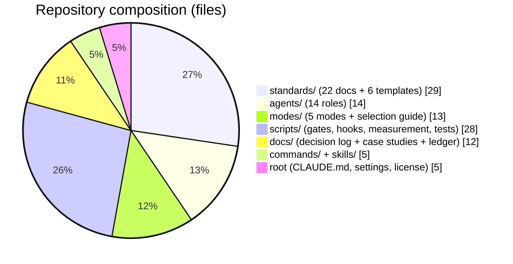
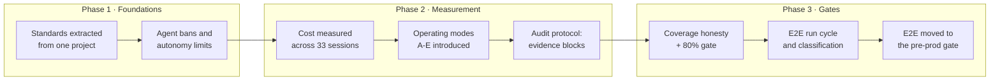

# claude-code-standards

The working rules, engineering standards and agent roles I use to build
production software with Claude Code. This is not a showcase written for
display — it is the live configuration, and most rules exist because something
broke first.

| What | Where | Count |
|---|---|---|
| Working rules (index loaded every session) | `CLAUDE.md` | 33 rules |
| Engineering standards | `standards/` | 22 documents + 6 templates |
| Agent roles (each with explicit scope and prohibitions) | `agents/` | 14 roles |
| Operating modes (agent use + review + approval policy) | `modes/` | 5 modes |
| Gate and measurement scripts | `scripts/` | 15 scripts |
| Slash commands and skills | `commands/`, `skills/` | 5 |
| Decision log (rationale and measurement per rule) | `docs/` | — |



## Why it is measurement-driven

There are numbers behind these rules, not opinions. The decision log records how
each rule was discovered, which measurement produced it, and the text of rules
that have since been retired.

**Test coverage: what was reported vs. what was true**

| | | |
|---|---|---|
| Reported (raw) | `████████████████████` | **95.0%** |
| Honest (generated code excluded) | `█████████████████░░░` | **83.0%** |
| Same project, web codebase | `███░░░░░░░░░░░░░░░░░` | **~14%** |

EF Core migrations made up **85% of the denominator**. A single averaged number
hid the fact that 107 of 136 web files had no test touching them at all.

**Where the cost actually was**

| | | |
|---|---|---|
| Orchestrator cache reads | `███████████████░░░░░` | **73%** of total |
| Agent turns | `██░░░░░░░░░░░░░░░░░░` | **7.7%** of total |

Every agent call required approval, and the stated reason was cost. The
measurement showed the approval friction was guarding 7.7% of the bill while
slowing down every turn.

**Estimate vs. measurement for one agent role (`qa`, opus)**

| | | |
|---|---|---|
| Estimated (before) | `████████████████████` | $8 – $20 / turn |
| Measured (3 records, script) | `████░░░░░░░░░░░░░░░░` | **$4.10** / turn |

The estimate was 2–5x too high. The table was corrected; the estimate was not
defended.

## Case studies

Each one ends with an **Honest limits** section: which numbers were measured,
which are estimates, and what is still open.

- [01 — The coverage illusion: how 95% turned out to be 83%](docs/case-01-coverage-illusion.md)
- [02 — 48 false failures: mistaking an environment limit for a product bug](docs/case-02-false-e2e-failures.md)
- [03 — Saving in the wrong place: measuring what agents actually cost](docs/case-03-agent-cost-measurement.md)
- [04 — Nine roles, one of them audited](docs/case-04-the-audit-gap.md)

## Progress

**Cost-table calibration** — how much of the cost model is measured rather than
estimated. This is the honest state, not a target:

| Role class | Status |
|---|---|
| `qa` (opus, auditing) | `████████████████████` measured — 3 records, ~$4.10/turn |
| Turn average across 33 sessions | `████████████████████` measured — ~$6.9/turn |
| `architect` / `developer` (writing roles) | `░░░░░░░░░░░░░░░░░░░░` estimated only |
| sonnet roles (`analyst`, `test-writer`, `devops`, …) | `░░░░░░░░░░░░░░░░░░░░` estimated only |
| `doc-writer` (haiku) | `░░░░░░░░░░░░░░░░░░░░` estimated only |
| Team modes (X / Y / Z) | `░░░░░░░░░░░░░░░░░░░░` never measured |

Thresholds have deliberately **not** been adjusted on this data: all three
calibration records came from the same kind of work, and a real end-to-end
feature turn has not been measured yet.



## Selected rules

- **Backward compatibility is mandatory** — APIs and databases evolve additively only; fields and endpoints are never deleted, renamed or retyped (#4)
- **Line coverage ≥ 80% per codebase, never averaged** — an unmeasured codebase does not count as passing (#29)
- **Merging to `dev` is fast; heavy gates run on promotion** — the quality gate belongs where code leaves for the outside world (#25)
- **Authorization is fail-closed** — default denied; "I forgot to configure it" must never mean "open to everyone" (#6)
- **Search is always case- and accent-insensitive** — raw `LIKE` / `ToLower.Contains` is banned; one central normalizer (#13)
- **A gate that did not run did not pass** — a skipped step is reported as skipped and the result is not green (#19)
- **A new rule is never left verbal** — a permanent decision is written to the file in the same turn (#14)

## Usage

```bash
git clone https://github.com/<user>/claude-code-standards
cp -r claude-code-standards/{CLAUDE.md,standards,agents,modes,commands,skills,scripts} ~/.claude/
cp claude-code-standards/settings.example.json ~/.claude/settings.json # review it first
```

You do not have to take it wholesale — the `standards/` documents read
independently. Rule numbers are linked between `CLAUDE.md` and the decision
log, so keep the numbering if you edit.

## Anonymization

These rules were measured on real client projects. Project names are replaced
with **Project A / B / C**; **the measurements are unchanged** — the numbers are
the rationale, the names are not.

## Deliberately NOT in this repository

- Client or project memory, business logic, data schemas, prompts
- Secrets, tokens, connection strings, hostnames, IP addresses
- Session transcripts, conversation history, generated artifacts
- Personal data and real email addresses (placeholders such as
 `<account>+<label>@gmail.com` are used instead)

That split is not arbitrary: the rules governing what must never be published
are part of the set itself, in `standards/15-security.md` (security) and
`standards/18-setup-and-environment.md` (setup and secret inventory).

## Language

Portfolio-facing documents (this file and the case studies) are in English.
The operating rule set is written in Turkish, which is the language it is used
in daily; identifiers in code are English either way.

## License

MIT — see `LICENSE`.
