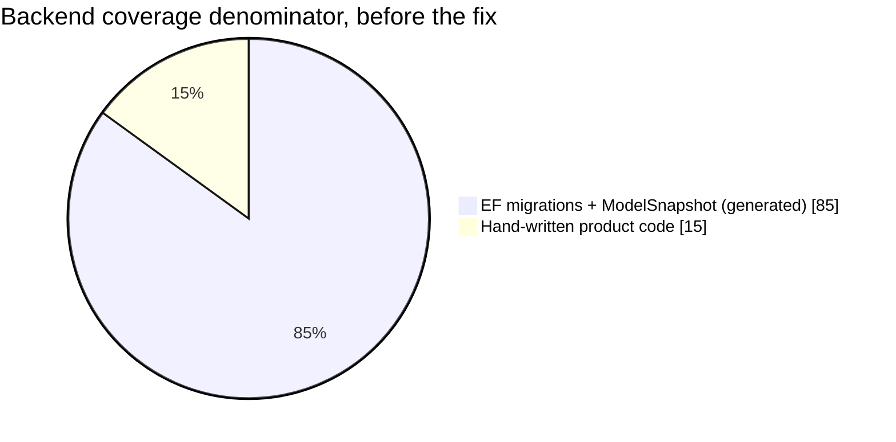
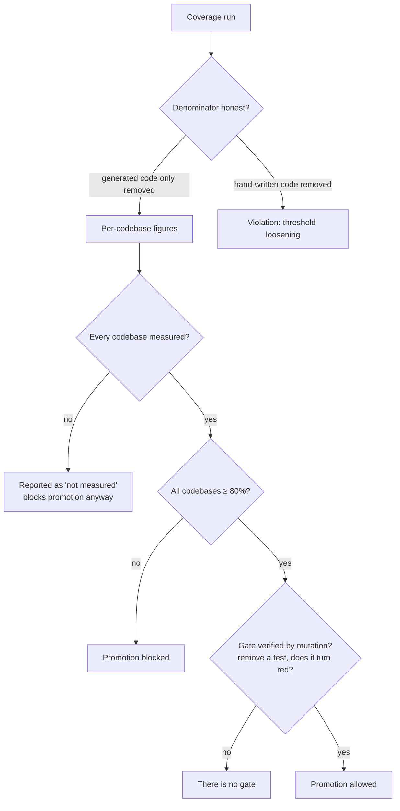

# Case 01 — The coverage illusion: how 95% turned out to be 83%

> **Summary:** A production project reported 95.0% test coverage. Once generated
> code was removed from the denominator, the real figure was **83.0%**. The same
> project's web codebase sat at roughly **14%**, with **107 of 136 files** never
> touched by a test — and a single averaged number hid all of it.
> Project: Project B (name withheld).

## Context

Project B is a production system: a .NET backend, a React (Vite) web client, and
Android and iOS mobile clients. The coverage figure appeared in CI output and on
a dashboard, and nobody disputed it: **95.0%**. The assumption that "testing is
in good shape" was built on that number.

## Measurement

Two things had to be measured separately — and separating them was the point.

### 1. Denominator honesty (backend)

The raw coverlet output counted EF Core migrations and `ModelSnapshot`.
Migrations execute on their own whenever tests run, which means they **look
tested**.

| | | |
|---|---|---|
| Raw (migrations included) | `████████████████████` | **95.0%** |
| Migrations excluded | `█████████████████░░░` | **83.0%** |



Migrations were **85% of the denominator**. The reported number was, in effect,
measuring the coverage of code nobody wrote by hand.

### 2. What the average hid (web)

Measured per codebase instead of as one figure:

| Codebase | | |
|---|---|---|
| Backend (honest) | `█████████████████░░░` | **83.0%** |
| Web | `███░░░░░░░░░░░░░░░░░` | **~14%** |

In the web codebase, **107 of 136 files had no test touching them at all.** As
long as one combined number was reported, this was invisible: 95% of backend was
covering for 14% of frontend.

## Finding

Three distinct failures were hiding inside one number:

1. **The denominator was inflated** — generated code was counted as product code.
2. **The figure was averaged** — four codebases collapsed into one number.
3. **There was no gate** — the number was reported but blocked nothing, so a
 drop stopped no one.

⚠️ The real lesson is not technical: **a wrong number was more dangerous than no
number.** Without measurement, the answer would have been "we don't know." With
a misleading measurement, the answer was "we're fine."

## Intervention



1. **The exclusion list lives in one file, with a reason per entry.** Only
 generated code may be excluded: EF migrations and `ModelSnapshot`, `obj/`,
 `*.g.cs`, `*.Designer.cs`, `.d.ts`, the tests themselves, e2e and config
 files.
 ⛔ Hand-written product code may never be excluded — not even files that are
 hard to test (an HTTP client, startup code). Hard files are tested with fakes
 (a fake `HttpMessageHandler`, a fake clock), not removed from the denominator.
2. **Every codebase is measured separately; figures are never averaged.** An
 unmeasured codebase does not count as passing — it is reported as
 **"not measured"** and still blocks promotion.
3. **A gate was added:** a step in the local gate script that runs in promotion
 mode and exits non-zero below the threshold. CI calls the same script — there
 are never two different rules in two places.
4. **Reports always carry both the raw and the honest figure.** Publishing the
 raw number alone was banned.
5. **The gate is verified by mutation:** remove a test from a covered file — does
 the gate actually turn red? If not, there is no gate.

## Outcome

The resulting rule — `CLAUDE.md` #29, detailed in
`standards/10-test-strategy.md` §7:

> Line coverage of **at least 80% in every codebase**. Never averaged. The
> denominator is made honest by excluding generated code only. The threshold is
> not lowered per project and no exceptions are granted; **a project's own
> `CLAUDE.md` cannot override this rule.** Writing assertion-free tests to raise
> coverage counts as loosening the threshold.

This was written as the single exception to the "project rules override global
rules" principle, precisely because the pressure to loosen appears at project
level.

## How to verify

```bash
# .NET — coverlet, cobertura output
dotnet test <sln> --collect:"XPlat Code Coverage" --results-directory <dir>
# ⚠️ two test projects produce separate files; the same line may appear in both →
# take the UNION of lines, not the sum

# Vitest — threshold in config, denominator narrowed with include
# coverage: { include: ['src/**/*.{ts,tsx}'], thresholds: { lines: 80 } }
npx vitest run --coverage

# Android — Kover; iOS — xcodebuild -enableCodeCoverage YES
./gradlew koverVerify

# Proof that the gate is real: remove a test from a covered file.
# If the gate does not turn red, there is no gate.
```

## Honest limits

- The rule says 80%; **closing the gap is still in progress.** A rule does not
 close a gap, it only blocks promotion — that is a deliberate choice.
- Mutation testing (Stryker) does not yet run on every critical module; today
 the gate's reality is verified by hand.
- E2E is not counted in this figure (it is a separate measure) — so 80% line
 coverage does not mean "the flow is tested."
