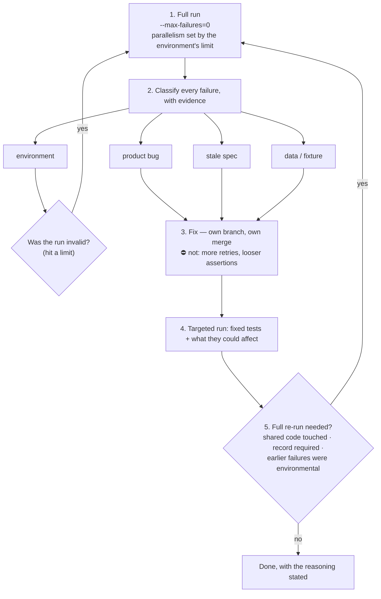

# Case 02 — 48 false failures: mistaking an environment limit for a product bug

> **Summary:** A Playwright suite running against a remote test environment with
> 8 workers hit the API rate limit, and **48 tests failed. None of them was a
> product bug.** Because the failures were not classified before the suite was
> re-run, the time was lost twice.
> Project: Project A (name withheld).

## Context

Project A's e2e suite runs against a remote test environment: each test creates
its own data through the API, and the flow itself is driven through the UI.
Parallelism had been raised to 8 workers for speed.

## Measurement

**48 tests red.** But the distribution did not look like a product bug: the
failures were spread across unrelated modules rather than clustering on one
behaviour. The actual cause was the run itself — 8 workers signing in and hitting
the API simultaneously tripped the **rate limit (429)**.

| Failure class | Count | |
|---|---|---|
| Environment (429 rate limit) | **48** | `████████████████████` |
| Product bug | 0 | `░░░░░░░░░░░░░░░░░░░░` |
| Stale spec | 0 | `░░░░░░░░░░░░░░░░░░░░` |
| Data / fixture | 0 | `░░░░░░░░░░░░░░░░░░░░` |

A second source of noise surfaced in the same period: e2e test data used
**fake-domain** email addresses such as `@sample-<project>.test`. Because the test
environment was wired to real SMTP, every invitation and link message bounced and
raised a delivery error. A **real** email failure would have been invisible inside
that noise.

## Finding

The actual defect was not technical, it was **how the result was read**:

1. **The run was invalid, but its result was treated as valid.** A run that hit
 the environment's limit says nothing about the product.
2. **There was no classification.** All 48 failures were seen as one pile, and the
 suite was re-run before anyone separated product causes from environment ones.
3. **"Probably flaky" was being treated as a diagnosis.** It is not — it is an
 unmeasured guess, and it masks whatever is actually broken underneath.

⚠️ The expensive move was not re-running the tests. It was **adopting a
misclassified run as the baseline** — every decision built on that baseline was
wrong too.

## Intervention

The run cycle became a rule (#31, `standards/11-playwright.md` §9a):



1. **Full run** — the whole suite runs and does not stop at the first failure
 (`--max-failures=0`). Parallelism is chosen **from the environment's limits**:
 rate limits, session/token lifetime, shared fixtures. Remote suites that sign
 in on every test run at low parallelism, usually **1 worker**.
2. **Classification — one class per failing test, with evidence:**
 *product bug* · *stale spec* · *data/fixture* · *environment* (429, timeout,
 deploy lag, expired session).
 Evidence is mandatory: error text, `trace.zip`, screenshot, network state, the
 test's result in previous runs. **"Probably flaky" is not a class.**
3. **Fix** — each fix on its own branch with its own merge.
 ⛔ Raising retries, blindly increasing waits, or loosening assertions does not
 count as a fix. For an environment-class failure, the fix is a *run setting*
 (parallelism, wait window), not the spec.
4. **Targeted run** — only the fixed tests and what those fixes could affect.
5. **The decision to repeat the full run is justified in writing.** It is
 repeated when: the fix touched something shared (layout, auth, a common
 component, a fixture helper, Playwright config) · the promotion record requires
 a valid full run · **some of the original failures were environmental** (in
 which case that run was never a valid baseline).
6. **An invalid run is never reported as a product result** — parallelism is
 lowered, the run is repeated, and this is stated explicitly.

Test-data email was also moved to a single helper that sends to a **real
mailbox** (#30); `.test`, `.local` and `example.com` were banned.

## Outcome

- False failures are no longer reported as product bugs; a run's validity is
 questioned before its result is.
- Parallelism is no longer a performance setting — it is a function of the
 environment's constraints.
- With the bounce noise gone, a real email failure became visible.

## The follow-up failure: what does a gate do when it cannot run?

Later, the same chain failed differently: the e2e step on the `test`
promotion **could not read the deploy-status file** because the artifact quota was
exhausted, so it never started e2e at all. The gate believed it had run while
running nothing.

That moved the timing (#33): there is no e2e in the `dev` or `test` direction —
no run, no waiting for a deploy. Both the missing specs and the run belong to the
**pre-production gate**: is the code on `test` → are any e2e specs missing → write
them → has this code been run → then `prod`. Nothing ships to `prod` without e2e;
the only exception is work the user explicitly calls a **hotfix**, and the report
must then read **"e2e skipped (hotfix)"** — which does not count as passing.

## How to verify

```bash
# Full run, no early exit, parallelism matched to the environment
npx playwright test --max-failures=0 --workers=1

# Evidence for an environment-class failure: 429 / timeout traces
npx playwright show-trace test-results/**/trace.zip

# Scan for fake-domain test email addresses
grep -rE '@[a-z0-9.-]+\.(test|local)\b|example\.com' e2e/
```

## Honest limits

- Classification is **manual**; evidence collection is not automated.
- Targeted re-running (`--only-failed` or equivalent) does not exist in every
 project; a file/line filter is used instead.
- The "did the gate actually run?" failure from 19/09 was solved by **changing the
 timing, not by adding a health check inside the gate.** The same class of
 failure can reappear in another step.
