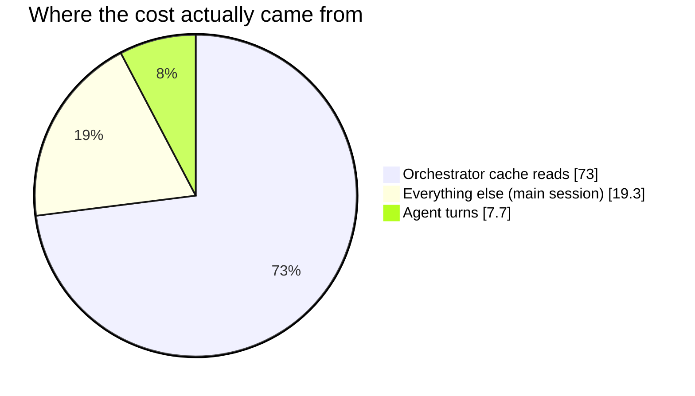

# Case 03 — Saving in the wrong place: measuring what agents actually cost

> **Summary:** Every agent call required approval, and the stated reason was cost.
> Measured across 33 sessions, agent turns were **7.7% of total cost**, while
> **73% came from the orchestrator's own cache reads.** The friction was not
> reducing cost — it was reducing *unpredictability*, and approval-per-call was
> the wrong tool for that. A second measurement then showed my own estimate was
> **2–5x too high.**

## Context

The chain has 9 (later 14) agent roles: `analyst`, `qa`, `developer`,
`test-writer`, `devops`, `architect`, `product-manager`, `security`, `data`,
`coverage-auditor` and others. The old rule required announcing every `Agent`
call and **waiting for approval**. The reason given was cost.

## Measurement 1 — the ratio (33 sessions)



| | | |
|---|---|---|
| Orchestrator cache reads | `███████████████░░░░░` | **73%** |
| Agent turns | `██░░░░░░░░░░░░░░░░░░` | **7.7%** |
| Average per agent turn | | **~$6.9** |

The overwhelming majority of cost accumulated in **the main session itself**, not
in the agents. Asking for approval on every call was policing 7.7% of the bill
while slowing down the entire turn.

⚠️ The measurement also showed the friction *was* doing something useful: asking
for approval did not lower cost, but it did make the turn's eventual cost
**known in advance**. The tool was wrong; the goal was not.

## Measurement 2 — calibration (by script)

The estimate table listed `~$8–20` for the `qa` role. The same session was then
measured with a script that sums the `usage` fields in the transcript:

| | | |
|---|---|---|
| Main session | `██████████████░░░░░░` | **$26.99** |
| Subagents (3 × `qa`/opus, 170 messages) | `██████░░░░░░░░░░░░░░` | **$12.31** |
| **Session total** | | **$39.30** |

Per `qa` turn: **~$4.10**.

| `qa` cost per turn | | |
|---|---|---|
| Estimated (before) | `████████████████████` | $8 – $20 |
| Measured (3 records) | `████░░░░░░░░░░░░░░░░` | **$4.10** |

The estimate was **2–5x too high**. The row was replaced with the measurement and
the estimate was not defended.

The second observation confirmed measurement 1: in the same session, $26.99 main
versus $12.31 subagent — most of the cost is still not in the agents, it is in the
orchestrator.

## Intervention

1. **Operating modes (A–E).** Agent usage, who performs review, and the approval
 policy are chosen **up front** with a single letter. **Choosing the mode is the
 approval** — no separate question per call. Predictability is preserved and the
 friction is gone.
2. **Two-stage, mode-dependent thresholds.** A warning line at half, a **stop** at
 the full figure:

 | Mode | Warning | **Stop** |
 |---|---|---|
 | A (no agents) | — | — |
 | B (selective, 3 roles) | ~$12 | **~$25** |
 | C (full team, 9 roles) | ~$75 | **~$150** |
 | D (wide team, 14 roles) | ~$130 | **~$260** |
 | E (fan-out) | ~$200 | **~$400** |

3. **Cost is not deferred to the end of the turn.** One line per role handoff:
 `↳ analiz done · ✅ clean (grep -rn X → 3) · ~$3 · turn total ~$9 · threshold ~$150 (C)`
4. **A measurement ledger.** Every real agent turn records `subagent_tokens` ×
 model price: role, model, description of the work, call count, duration, tokens,
 lower/upper cost bound. The table is **never changed on a single measurement** —
 it takes at least 3 records or one real end-to-end turn.
5. **`MEASURED` / `NOT MEASURED` labels in the table.** An estimate is never
 presented as a measurement.

## Outcome

The rule changed: in mode A there are no agents; in B/C/D/E **choosing the mode is
the approval**, and the agent count plus estimated cost are reported at the end of
the turn. The old "approval before every call" rule was retired into this one.

## Honest limits

This is the most important part of the case:

| What | Status |
|---|---|
| Average per turn (~$6.9, 33 sessions) | `████████████████████` **measured** |
| `qa` / opus (~$4.10, 3 records) | `████████████████████` **measured** |
| `architect` / `developer` (the writing roles) | `░░░░░░░░░░░░░░░░░░░░` never measured |
| sonnet roles (`analyst`, `test-writer`, `devops`, …) | `░░░░░░░░░░░░░░░░░░░░` estimate only |
| `doc-writer` / haiku | `░░░░░░░░░░░░░░░░░░░░` estimate only |
| Team modes X / Y / Z | `░░░░░░░░░░░░░░░░░░░░` never measured |

- Only **two numbers in the table are measured**. Every other row is derived from
 model price ratios and is labelled as an estimate.
- **The writing roles were never measured** — all three calibration records were
 auditing turns, which are cheaper by nature.
- **Thresholds were not adjusted on this calibration**, because all three records
 came from the same kind of work (reviewing rule files) and a real end-to-end
 feature turn still has not been measured.

## How to verify

```bash
# Real cost of a session (sums the usage fields in the transcript)
python3 ~/.claude/scripts/session-cost.py <session-id>

# If only subagent_tokens is available: tokens × current per-MTok price
```

## Takeaway

When you defend a control, measure its stated reason. Here the reason ("cost") was
wrong while the benefit it delivered ("predictability") was real. The measurement
separated the two, which made it possible to move to a tool that provides the same
benefit far more cheaply.
