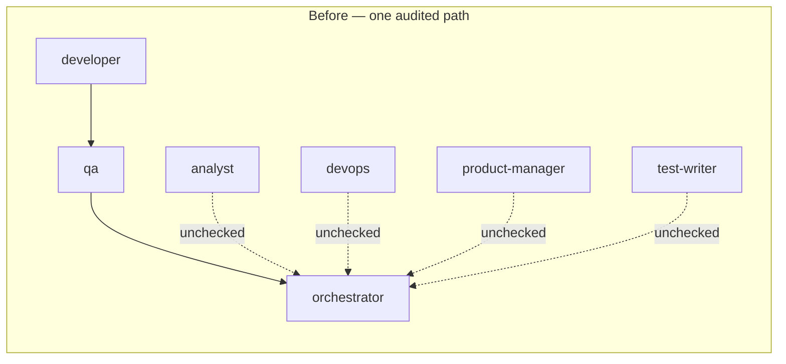
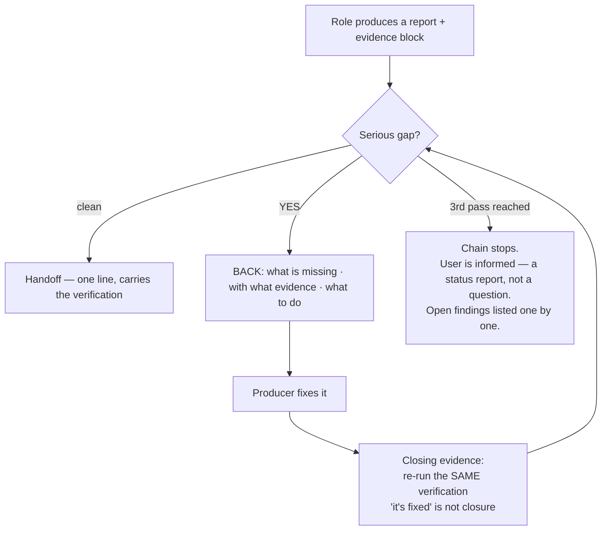
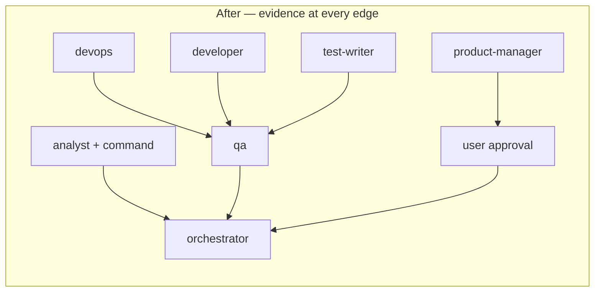

# Case 04 — Nine roles, one of them audited

> **Summary:** The agent chain had nine roles, but only `developer` was
> genuinely audited — its output went to `qa` and from there to the orchestrator.
> If `analyst` miscounted, if `devops` broke a gate, if `product-manager` missed
> scope, the error **flowed downstream silently.** Adding an auditor agent was
> rejected on measurement: subagent tokens cost roughly **4x** more. The fix was
> not another agent — it was **mandatory evidence**.

## Context

The chain worked like this: the orchestrator hands work to a role, the role returns
a report, the orchestrator uses the result. Code written by `developer` passed
through `qa`. The output of the other eight roles was used **directly**.



## Finding

The audit gap came from the nature of the roles themselves:

| Role | The gap |
|---|---|
| `analyst` | says "used in 3 places", misses the 4th — nobody recounts |
| `devops` | breaks the gate or CI, passes review-free as "config, not code" |
| `product-manager` | misses scope, and its output flows into the chain on its own |
| `test-writer` | writes assertion-free tests, coverage rises, nothing is caught |

⚠️ `analyst` was the most insidious: **reading a lot and returning little was the
role's entire reason to exist.** When it miscounted, the only way to verify was to
redo the whole scan — which destroys the reason for using the agent. The role's
usefulness and its auditability were in direct conflict.

The obvious fix — adding a second auditor agent behind `qa` — was eliminated by
measurement:

| Option | Cost | Verdict |
|---|---|---|
| Second auditor agent | `████████████████████` ~4x subagent tokens | rejected |
| Returning the command that produced the finding | `░░░░░░░░░░░░░░░░░░░░` ≈ 0 | adopted |

## Intervention

### 1. The evidence block (mandatory, at the end of every report)

Every role whose output someone else will rely on closes its report with this:

```
## Completeness check — pass N
- Verification → command run / line range read + raw result
- Item mapping → each requested item → where it is (file:line)
- Not covered → what could not be verified + what was deliberately left out
→ Result: clean NO | YES → BACK TO: <who> · <what to fix> · <closing evidence>
```

- The block is written **even when the pass is clean** — an invisible check is an
 unperformed check.
- The answer **carries evidence, not a template**: "yes, I'm sure" is invalid;
 "verified with `grep -rn X` across 3 files, the 4th match is in a test file" is
 valid.
- **What cannot be verified does not count as fine** — it is reported as
 "not verified."

### 2. Free auditing: return the command

`analyst` returns not just the result but **the command that produced it**
(`grep -rn "X" --include=*.cs`, `rg -c`, `find`). The orchestrator re-runs it in a
second and compares the count.

This delivers most of a full audit at **near-zero cost** — the work of an agent
that costs four times as much, bought with a one-line change to the contract. If
the command is not returned, the finding counts as **"not verified."**

### 3. Sending work back is an order, not a note



- If something is missing, the work **does not move forward** — it returns to the
 producer: *what is missing · with what evidence · what to do.*
- **It is not escalated to the user.** The auditor does not ask "is anything
 missing?" — not the user, not the producing role. It looks, writes the evidence,
 and decides. Handing it over as "does this look right to you?" is not auditing,
 it is returning responsibility.
- **Closing evidence:** when a fix arrives, **the same verification that surfaced
 the finding is re-run.** A claim of "fixed" is not closure.
- **Ceiling: the same work is sent back at most twice (3 passes).** Then the chain
 stops and the user is **informed** — a status report, not a question. Unclosed
 findings are listed individually as **open findings**; quietly dropping one, or
 handing off with "I tried, it didn't work," is forbidden.

### 4. Two more gaps closed

- `devops` output **goes through `qa`** — "config, not code" is not an exemption.
- `product-manager` output does not flow into the chain automatically; it goes to
 **user approval**.



## The measured trade-off: from two clean passes to one

Initially a handoff required **two consecutive clean passes**. This was later reduced
to one. The reason was measured: in a 14-role turn, the second pass was
roughly **22% of the estimated cost**.

| | | |
|---|---|---|
| Second pass, share of a 14-role turn | `████░░░░░░░░░░░░░░░░` | **~22%** |

⚠️ This did **not** loosen the evidence block — it made it the *only* safeguard.
With no second pass, an unevidenced "clean" is caught nowhere. That is exactly why
the `Verification` line is now **required** to carry the command that was run.

The orchestrator's cadence was simplified on the same logic: **one
line per handoff**, with the full block written **once at the end of the turn** and
on every "YES" decision. That reduced 14 orchestrator blocks in a 14-role turn to
one — with no loss of evidence, since each role's own block and every "YES"
decision are passed through untouched.

## Outcome

The cost of auditing was moved onto **the shape of the output** rather than onto an
agent that costs four times as much: a report without evidence is not accepted,
what cannot be verified does not count as fine, and no handoff happens while a
finding is open.

## Honest limits

- **~22% is an estimate**, not a measurement — and the decision to drop to a single
 clean pass rests on it.
- The evidence block's **format** is mandatory; the **quality** of the evidence
 still depends on the orchestrator reading it. Filling in the template and
 mistaking it for evidence remains technically possible.
- When the ceiling (3 passes) is hit, the work stops, but the **open-findings list
 is maintained by hand** — there is no automated tracking.
